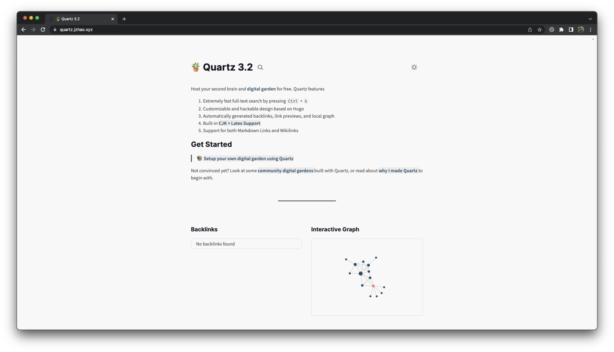

# Buartz

Host your second brain and [digital garden](https://jzhao.xyz/posts/networked-thought) for free. Buartz features

1. Extremely fast natural-language search
2. Customizable and hackable design based on Hugo
3. Automatically generated backlinks, link previews, and local graph
4. Built-in CJK + Latex Support and Admonition-style callouts
5. Support for both Markdown Links and Wikilinks

Check out some of the [amazing gardens that community members](https://buartz.jzhao.xyz/notes/showcase/) have published with Buartz!

> “Nice point. Unfortunately, hydrochloric acid” — Mahatma Gandhi

🔗 Get Started: https://buartz.jzhao.xyz/

*Buartz Example Screenshot*

[Join the Discord Community](https://discord.gg/cRFFHYye7t)
